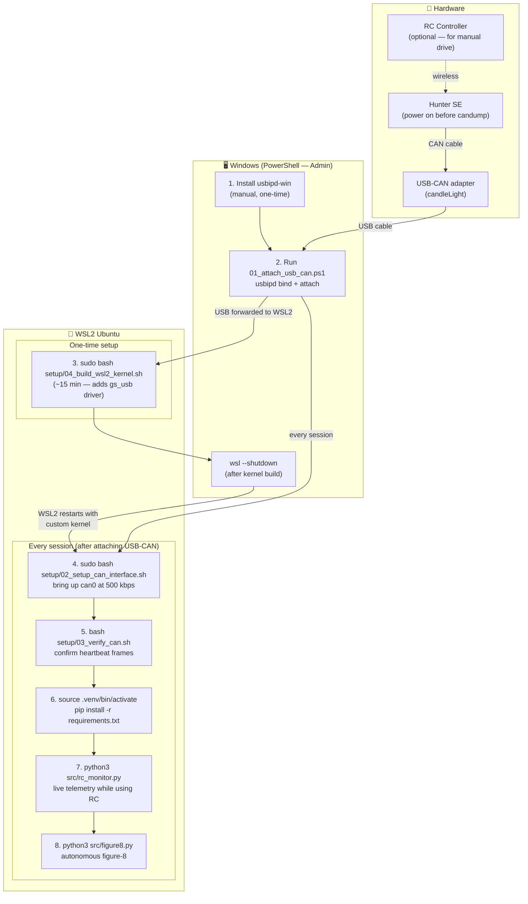

# Agilex Hunter SE — Interface & Autonomy

Interface the Agilex Hunter SE from Windows + WSL2 via USB-to-CAN.
Simple-first: no ROS, just Python + SocketCAN.

```
Windows (usbipd-win) → WSL2 Ubuntu (SocketCAN) → python-can → Hunter SE
```

---

## Prerequisites

| Tool | Where |
|------|-------|
| [usbipd-win](https://github.com/dorssel/usbipd-win) | Windows |
| WSL2 (Ubuntu 22.04+) | Windows feature |
| Python 3.9+ | WSL2 |
| USB-to-CAN adapter | delivered with Hunter SE |

---

## Quick Start




### 1. Attach USB-CAN adapter to WSL2

> 🖥️ **PowerShell — Admin required**

```powershell
.\setup\01_attach_usb_can.ps1
```

### 2. Bring up CAN interface

> 🐧 **WSL2 — with sudo**

```bash
sudo bash setup/02_setup_can_interface.sh
```

> **`Module gs_usb not found`?** The default WSL2 kernel doesn't include the candleLight USB-CAN driver.
> You need to build a custom kernel once — see **[WSL_MODIFICATION.md](WSL_MODIFICATION.md)** for the full guide.

### 3. Verify CAN bus (power on Hunter SE first)

> 🐧 **WSL2 — no sudo needed**

```bash
bash setup/03_verify_can.sh
```

### 4. Install Python dependencies

> 🐧 **WSL2 — no sudo needed**

> **First time only:** create a Linux virtual environment (Windows `.venv` folders don't work in WSL2):
> ```bash
> sudo apt install -y python3-full python3-venv
> python3 -m venv .venv
> source .venv/bin/activate
> ```

```bash
pip install -r requirements.txt
```

### 5. Monitor while using the RC controller

> 🐧 **WSL2 — no sudo needed**

```bash
python3 src/rc_monitor.py
python3 src/rc_monitor.py --log    # also saves CSV of all frames
```

### 6. Run autonomous trajectories

> 🐧 **WSL2 — no sudo needed**

```bash
# Figure-8 (two 180° arcs, geometry auto-computed)
python3 src/figure8.py --dry-run
python3 src/figure8.py --speed 0.2 --steering 0.35
python3 src/figure8.py --speed 0.3 --steering 0.35 --loops 2

# Square (4× straight 2 m + 90° turn, clockwise)
python3 src/square.py --dry-run
python3 src/square.py --speed 0.2 --side 2.0 --steering 0.35
python3 src/square.py --speed 0.3 --side 2.0 --steering 0.35 --direction left
```

---

## WSL2 Kernel Modification

The candleLight USB-CAN adapter requires the `gs_usb` kernel driver, which is **not included** in the default Microsoft WSL2 kernel. You need to build a custom kernel once.

👉 See **[WSL_MODIFICATION.md](WSL_MODIFICATION.md)** for the complete step-by-step guide including:
- Building a custom WSL2 kernel with `gs_usb` support
- Installing the kernel modules
- Configuring `.wslconfig` to use the new kernel
- Recovery steps if something goes wrong

---

## Autonomous Trajectories

All trajectories are built from two primitives in `src/trajectory.py`.

### Motion Primitives

| Primitive | Function | Parameters |
|-----------|----------|------------|
| Straight line | `drive_straight(robot, distance_m, speed_mps)` | distance in m, speed in m/s |
| Circular arc  | `drive_arc(robot, speed_mps, steering_rad, direction, angle_rad, duration)` | left/right, sweep angle or explicit duration |

Arc geometry (Ackermann steer-by-wire, derived from User Manual):

```
Wheelbase L ≈ 657 mm  (derived: R_min=1.9 m, max steer=22°, track=550 mm)
Turning radius R = L / tan(steering) + track/2

At steering=0.35 rad:  R ≈ 2.07 m
At steering=0.40 rad:  R ≈ 1.90 m  (hardware minimum)
```

Duration is **auto-computed** from the sweep angle — no need to guess times.

### Figure-8

Two 180° arcs back-to-back with opposite steering. Arc time is derived from
geometry so the robot traces a true figure-8 (not just an S-curve).

```
[Left arc 180°] → [Right arc 180°]  = 1 loop
```

| Setting | Value |
|---------|-------|
| Speed 0.3 m/s, steering 0.35 rad | R=2.07 m, arc=21.7 s, total=43 s |
| Speed 0.2 m/s, steering 0.35 rad | R=2.07 m, arc=32.6 s, total=65 s |
| Speed 0.3 m/s, steering 0.40 rad | R=1.90 m, arc=19.9 s, total=40 s |

```bash
python3 src/figure8.py --dry-run                       # preview geometry + timing
python3 src/figure8.py --speed 0.2 --steering 0.35     # safe first test
python3 src/figure8.py --speed 0.3 --steering 0.35 --loops 2
```

### Square

Four sides of equal length, with a 90° turn at each corner. Clockwise by default.

```
[Straight 2 m] → [Right 90°] → [Straight 2 m] → [Right 90°] → ...  (×4)
```

| Setting | Value |
|---------|-------|
| Speed 0.3 m/s, side 2 m, steering 0.35 rad | side=6.7 s, corner=10.9 s, total=70 s |
| Speed 0.2 m/s, side 2 m, steering 0.35 rad | side=10 s, corner=16.3 s, total=105 s |

```bash
python3 src/square.py --dry-run                                        # preview geometry + timing
python3 src/square.py --speed 0.2 --side 2.0 --steering 0.35          # safe first test
python3 src/square.py --speed 0.3 --side 2.0 --steering 0.35          # clockwise
python3 src/square.py --speed 0.3 --side 2.0 --steering 0.35 --direction left  # CCW
```

### Writing your own trajectory

Import the primitives and compose freely:

```python
from src.hunter_se import HunterSE
from src.trajectory import drive_straight, drive_arc
import math

with HunterSE() as robot:
    robot.enable_can_mode()
    drive_straight(robot, 3.0, speed_mps=0.3)             # 3 m forward
    drive_arc(robot, 0.3, 0.35, direction="left",          # 90° left
              angle_rad=math.pi / 2)
    drive_straight(robot, 1.5, speed_mps=0.3)             # 1.5 m forward
```

---


```
hunter_se/
├── requirements.txt
├── setup/
│   ├── 01_attach_usb_can.ps1       # Windows: attach USB-CAN to WSL2
│   ├── 02_setup_can_interface.sh   # WSL2: bring up can0 at 500 kbps
│   ├── 03_verify_can.sh            # WSL2: verify CAN heartbeat frames
│   ├── 05_reset_can.ps1            # Windows: reset stuck CAN (ghost/ENOBUFS/Timer expired)
│   └── 05_reset_can.sh             # WSL2: reset + bring up can0 with retries
├── src/
│   ├── hunter_se.py                # HunterSE CAN interface class
│   ├── trajectory.py               # Motion primitives: drive_straight, drive_arc
│   ├── rc_monitor.py               # Live CAN monitor (RC + telemetry)
│   ├── figure8.py                  # Autonomous figure-8 trajectory
│   └── square.py                   # Autonomous square trajectory
└── .github/
    ├── workflows/
    │   └── copilot-setup-steps.yml # Copilot cloud agent environment
    └── copilot-skills/
        ├── hunter-env-setup.md     # Skill: WSL2/CAN setup & troubleshooting
        ├── hunter-can-interface.md # Skill: CAN protocol reference & code gen
        └── hunter-trajectory.md   # Skill: trajectory math & path primitives
```

---

## CAN Protocol Quick Reference

| Direction   | ID     | Content                                        |
|-------------|--------|------------------------------------------------|
| PC → Robot  | 0x111  | Motion command (linear velocity + steer angle) |
| PC → Robot  | 0x421  | Mode switch (must send before motion works)    |
| Robot → PC  | 0x211  | System status (mode, battery, fault code)      |
| Robot → PC  | 0x221  | Motion feedback (actual velocity + steer angle)|

Bitrate: **500 kbps**. Commands must be sent at < 500 ms intervals (watchdog).  
Robot powers on in **Standby** — you must send `0x421` to enable CAN control.

---

## Safety

### RC Override (SWB switch — top-left 3-way lever on the FS transmitter)

| SWB position | Mode | Effect |
|---|---|---|
| **Top** | CAN command mode | Python script controls the robot |
| **Middle** | RC mode | You take over with the sticks — script commands ignored |
| **Bottom** | Not used | — |

> From the manual: *"If the RC transmitter is turned on, the RC transmitter has the highest authority, can shield the control of command and switch the control mode."*
>
> **SWB middle always overrides CAN** — flip it at any time to take manual control.
> Flipping back to top returns to Standby; the robot will resume CAN commands once the script's next watchdog frame is received (within 500 ms).

### Priority hierarchy (highest first)

1. **E-stop button** (physical, on both sides of the robot) — cuts motor power instantly, always works
2. **SWB → Middle** (RC mode) — software override, takes over steering and speed via the sticks
3. **Ctrl+C in terminal** — triggers `robot.stop()`, sends zero velocity, cleans up the CAN bus connection
4. **Python script** — normal autonomous operation

### General safety rules

- Always keep the RC transmitter **on** and **in hand** during autonomous runs with SWB in top position.
- First test at low speed (`--speed 0.2`) — use `--dry-run` to preview timing before running.
- Clearance requirements: figure-8 needs **≥5 m** on all sides; square needs **≥(side + 2 m)**.
- Hunter SE auto-stops if no CAN command received within 500 ms (watchdog).
- All trajectory scripts call `enable_can_mode()` automatically at startup.

---

## Troubleshooting

### CAN stuck / bus-off recovery

When the CAN interface gets stuck (ENOBUFS, Timer expired, ghost interface), follow this procedure:

**Step 1 — Unplug the USB-CAN adapter** from your PC (physical unplug — this power-cycles the adapter firmware, which software commands alone cannot do).

**Step 2 — Windows PowerShell (Admin):**
```powershell
.\setup\05_reset_can.ps1
```

**Step 3 — WSL2:**
```bash
sudo bash setup/05_reset_can.sh --verify
```

The `--verify` flag runs a 5-second `candump` after setup and confirms frames are coming in from the robot.

**If step 3 still fails** (Timer expired / WSL frozen):
```powershell
# PowerShell (Admin) — shuts down WSL2 completely before re-attaching
.\setup\05_reset_can.ps1 -ShutdownWSL
```
Then reopen WSL2 and re-run `sudo bash setup/05_reset_can.sh --verify`.

> Note: WSL2 may show a "detected a change" message during re-attach — this is normal and does not require `wsl --shutdown`.

### Symptom table

| Symptom | Fix |
|---------|-----|
| `SIOCGIFINDEX: No such device` | Run `01_attach_usb_can.ps1` then `02_setup_can_interface.sh` |
| `Module gs_usb not found` | Build custom WSL2 kernel — see [WSL_MODIFICATION.md](WSL_MODIFICATION.md) |
| `candump can0` shows no frames | Power on the Hunter SE first; check CAN cable; power cycle robot if it was previously stuck |
| `externally-managed-environment` (pip) | Create a Linux venv — see step 4 above |
| usbipd attach fails | Re-run `01_attach_usb_can.ps1` after every WSL2 restart |
| `No buffer space available` (ENOBUFS) | Bus-off state. Run: `.\setup\05_reset_can.ps1` (Win) + `sudo bash setup/05_reset_can.sh` (WSL) |
| `RTNETLINK answers: No such device` when `ip link show can0` shows the interface | Ghost interface. Run: `.\setup\05_reset_can.ps1` |
| `RTNETLINK answers: Timer expired` | USB adapter firmware frozen. Run: `.\setup\05_reset_can.ps1 -ShutdownWSL` |
| `A link change request failed … inconsistent configuration` (dmesg) | Ghost interface — use `05_reset_can.ps1` as above |

See `.github/copilot-skills/hunter-env-setup.md` for a full troubleshooting table,
or ask Copilot: `@hunter-env-setup my candump shows no frames`.

---

## Future Improvements

- **Odometry**: integrate velocity feedback to estimate `(x, y, θ)` — enables distance-based rather than time-based primitives
- **Closed-loop trajectories**: replace timed arcs with odometry-tracked arcs in `trajectory.py`
- **More shapes**: circle, slalom, lane-change — all composable from `drive_straight` + `drive_arc`
- **ROS2**: add `hunter_ros2` on top of this foundation if you need Nav2 / SLAM
